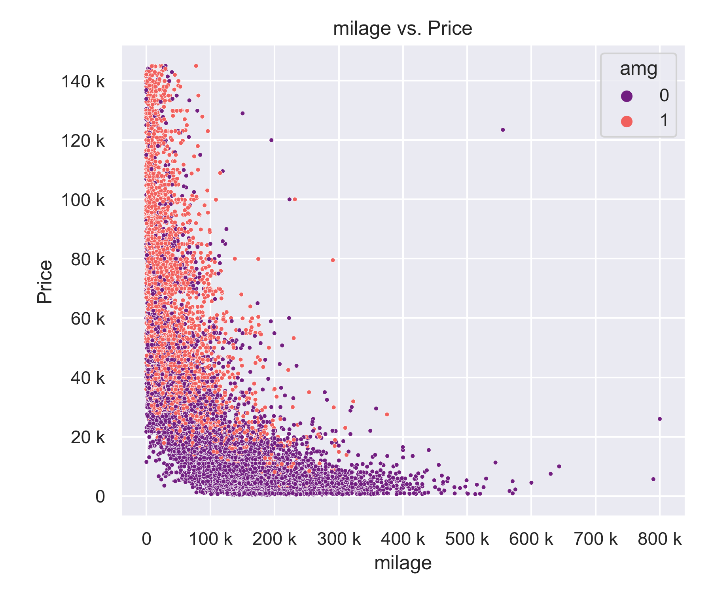

# Data Science Project Overview: Price Estimator of Mercedes Cars
## Collecting Data with a Webscraper and implement a Machine Learning Pricing-System
Fascinated about real-life ML applications and inspired by the [Machine Learning Phoenix Pricing System of Used Cars](https://www.daimler.com/karriere/ueber-uns/artificial-intelligence/fuer-nerds/pricing.html) from Mercedes-Benz, I thought, I could start a similar project in a small scale in order to explore and strengthen my Data Science skills.
In this project, I
* Implemented a data collection tool and webscraped over 11000+ car descriptions and data from [mobile.de](https://www.mobile.de) using python and selenium
* Implemented a ML tool, that estimates prices (MAE ~ $ X K) to help customers and sellers estimating the worth of a car
* Cleaned and wrangled raw data and engineered features from existing features
* Optimized Linear, Lasso, and Random Forest Regressors using GridsearchCV to find the best fitting model
* Optimized also with statsmodels 

## Code and Resources Used 
**Python Version:** 3.7 
**Packages:** pandas, numpy, sklearn, statsmodels, tensorflow, matplotlib, seaborn, selenium

## Web Scraping
Implemented own web scraper and scraped minimum 11000 car offerings from [mobile.de](https://www.mobile.de). Each car, I scraped the following content from the webpage:
*	Carname/ model (Automodell)
*	Price (Preis)
*  Milage (Kilometerstand)
*  Num Owners (Anzahl Vorbesitzer)
*	Cylinder Cubic Capacity (Hubraum)
*	Power (Leistung)
*	Fuel Type (Kraftstoffart)
*	Transmission (Getriebeart) 
*	First Registration (Erstzulassung)
*	Construction Year (Baujahr)
*	Num Seats (Anzahl Sitze)
*	Num Doors (Anzahl Türen)
*	Emmission Class (Emmissionsklasse)
*	Car Type (Autotyp zB Limousine, Coupe,.. etc)
*	Damage (Schaden)

## Data Cleaning
After scraping the data, I cleaned & feature-engineer it up so that it was usable for our Machine Learning modeling & training. Following changes were made and the following variables were created:

*	Parsed numeric data out of "Price", removed the -brutto- string
*	Removed rows without a price (price = -1)
*	Transformed "First Registration" string into numeric "Age of car"" ("06/2018" --> 1.5)
*  Fill in missing values of "power_ps" with the means of existing values of each the same car Model type
*  Remove oldtimer (> 30 years of age) rows from the data, because too specific, needing more information to predict price
*	Parsed following Car Models out of the offering description and make a "Model" column with following:
    * A-Klasse
    * C-Klasse
    * E-Klasse
    * S-Klasse
    * CLA
    * CLC
    * CLK
    * CL
    * CLS
    * SL
    * SLC
    * SLK
    * SLR
    * SLS
    * G-Klasse
    * GLA
    * GLB
    * GLC
    * GLK
    * GLE
    * M-Klasse
    * GLS
    * GL
    * X-Klasse
    * B-Klasse
    * R-Klasse
    * V-Klasse
    * Vaneo
    * Viano
* Created follwong new features out of existing ones:
    * AMG
    * McLaren
    * Black Series
    * Brabus
    * Carlsson
    * DC
    * G-Power
    * 63
    * 65
    * 55
    * BlueEfficiency

## EDA --CURRENTLY DOING--
Distributions of the data and some of the value counts for the categorical variables are visualized with seaborn and matplotlib. Below are a few findings from the pivot tables: 

 
 

## Model Building --TO-DO--

I transformed all the categorical variables (like "Owners") into dummy variables with sklearn and then split the data randomly up into train and tests sets with a test size of 20 %.   

I tried X different models and evaluated them with the metric Mean Absolute Error.  

The following models were trained:
*	**Linear Regression** – Baseline for the model
*	**Lasso Regression** – Because of the sparse data from the many categorical variables, I thought a normalized regression like lasso would be effective.
*	**Random Forest** – Again, with the sparsity associated with the data, I thought that this would be a good fit. 
*	**Neural Network**

## Model performance --TO-DO--
The XYZ model outperformed the other approaches on the test and validation sets. 
*	**X** : MAE = X
*	**Y**: MAE = Y
*	**Z**: MAE = Z
